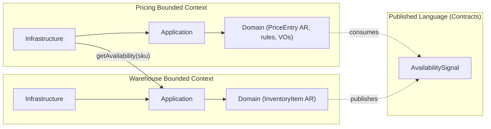

Software engineering has always been a human problem, and honestly, it still is.

The hard part was never typing code. The hard part is our limited capacity to hold the right information in our head while solving a task. Once the relevant information becomes too much, things slow down, mistakes happen, and we start creating accidental complexity without really noticing it.

Exactly the same thing happens with LLMs.

This is not mainly about hitting a hard context limit. Even far below the maximum context window, model performance already goes down as prompts grow larger and noisier. Research shows that irrelevant or badly structured context hurts reasoning quality, even when the model technically "supports" long inputs.

So if you want AI-assisted coding to actually be reliable, the goal is not stuff more context into the prompt.
The goal is to design systems so that each task needs less context in the first place.

One of the most effective ways to do that is bounded contexts.

Bounded contexts are not just some old-school architectural pattern.
They are one of the most effective ways to improve the Signal-to-Noise Ratio for both humans and AI agents working on the same codebase.

## 1) The problem: AI amplifies complexity

AI can write code faster than we can reason about it.

The bottleneck in modern development is no longer typing speed, it is context management. When multiple AI agents work on the same product, complexity compounds faster than it ever did with humans. And the failure modes show up very quickly:

- hallucinations
- unsafe refactorings
- fragile changes
- accidental coupling

The problem is not that the model is "not smart enough".

The problem is that we give it too much irrelevant context, which creates ambiguity. And ambiguity is where correctness usually dies.

## 2) The solution in one minute: bounded contexts

A bounded context is a clearly defined slice of the system where:

- language is consistent
- responsibilities are clear
- models do not leak across boundaries

Think about a supermarket. You do not need to know where every item is located. You only need to know which section to search, vegetables, bakery, meat, and so on.

Bounded contexts apply the same principle to code. They reduce the search space.

These boundaries were originally designed for humans. But they map extremely well to what LLMs need to perform reliably, which is a small, high-signal working set.

## 3) Why AI needs boundaries: signal-to-noise ratio

### Attention is a scarce resource

Modern LLMs are built on the Transformer architecture, which relies on attention mechanisms to decide which tokens matter during prediction.

Attention is capacity, not magic. As more irrelevant tokens enter the context window, attention gets diluted. Bigger context does not automatically mean better results.

This is not just theory. Multiple studies show that even long-context models struggle to reliably use relevant information when the prompt grows, especially when relevant parts are surrounded by distractors or sit somewhere in the middle of a long input.

In short, more tokens can actually make reasoning worse.

### Monoliths destroy signal

Now translate this into software architecture.

A monolith, especially one built around shared models and reusable services, forces an AI agent to ingest a lot of unrelated code. You end up with big classes and types that mix concerns.

The classic example is an Order model that slowly absorbs billing, stock, promotions, shipping, seller logic, and whatever comes next.

Even if the change you want to make is small, tight coupling forces broad retrieval. Relevant tokens compete with irrelevant ones, and the Signal-to-Noise Ratio drops.

### Bounded contexts concentrate signal

Bounded contexts flip this dynamic.

By slicing the application into vertical subdomains, each context limits the retrieval and reasoning scope. The tokens in the prompt become higher density and higher relevance.

The result is fewer hallucinations, safer refactorings, and clearer intent.

### Parallelism without chaos

There is another important side effect.

Independent contexts allow multiple AI agents to work in parallel without stepping on each other's toes. Not only do you get fewer merge conflicts, you also get fewer conceptual collisions.

An "order" in billing is not the same thing as an "order" in warehouse. Bounded contexts keep those meanings separate by design.

Bounded contexts are attention boundaries. They protect the model's focus.

## 4) The experiment: monolith vs bounded contexts

To make this more concrete, I built a small TypeScript backend for a supermarket system in two versions:

1. A monolith
2. A bounded-context-based design

Both implementations expose the same API and both must pass the exact same API-level test suite. From the outside, they behave identical.

The difference is entirely inside the system.

### The monolith (what AI generates by default)

Without explicit guidance, an AI usually produces something like this:

```
src/
  api/ (routes, controllers)
  core/
    models/ (Product, Inventory, Price, Promotion, Reservation, Money, Order…)
    services/ (PricingService, WarehouseService, InventoryService…)
    rules/
    repositories/
  shared/
```

This structure is familiar, convenient, and dangerous.

Models are shared. Services call each other freely. Rules live in central folders with no clear ownership. Everything works, tests pass, but coupling grows silently.

### The bounded-context version

In the bounded-context version, the system is split into two explicit contexts:

- Pricing
- Warehouse

The only shared surface is a small, explicit contract.

To enforce this, I use dependency-cruiser rules. These rules are not documentation or conventions.

This is not a linter warning. It is a build failure.

If an AI agent tries to import a Warehouse domain model into Pricing, the build breaks immediately. The dependency rules are the architecture spec.

## 5) The bounded-context map and the contract

This is the structure the system enforces:



In DDD terms, this relationship has a precise name:

- Customer–Supplier relationship
- Published Language as the integration pattern

Pricing is the customer. Warehouse is the supplier. The shared language is intentionally small and boring.

## 6) The showdown: one change that breaks weak architecture

The change request is deliberately cross-context:

**Pricing behavior depends on warehouse state.**

For example, during Black Friday a discount applies. But if the item is low stock, the discount should be reduced or skipped entirely. Warehouse does not care about Black Friday. Pricing does.

### What happens in the monolith

In the monolith, the AI takes the path of least resistance.

It already has access to everything, so it reaches straight through the abstraction. Pricing logic imports inventory data directly and checks stock counts inline.

In practice, this becomes something like:

```typescript
if (product.inventory.count < 5) { reduceDiscount(); }
```

It works.
The tests pass.
And you have just created a distributed monolith.

Now the coupling is implicit:

- Pricing logic depends on warehouse internals
- Inventory semantics leak into pricing rules
- The next change requires even more context to avoid breaking something

Nothing explodes immediately. But the system just became harder to reason about, for humans and for AI agents.

### What happens with bounded contexts

In the bounded-context design, this shortcut is impossible.

Pricing does not have access to inventory internals. It only sees a published contract: AvailabilitySignal.

So the AI is forced to stop and think:

*"I don't have inventory. I only have availability."*

The code becomes:

```typescript
if (availability.isLow) { reduceDiscount(); }
```

In one sentence, this is the difference:

**In the monolith, the AI reaches through the abstraction** (`product.inventory.count`).
**In the bounded context, it is forced to respect the contract** (`availability.isLow`).

That single constraint is doing a lot of architectural work.

## 7) Conclusion: architecture is context engineering

Context engineering is not stuffing more information into the prompt.

It is not mainly about skills, commands, or clever prompt tricks.

It is a strong foundation, a well-structured application that reduces ambiguity and keeps tasks local:

- separate by bounded context and map to subdomains
- keep write consistency inside aggregate roots
- make cross-context contracts explicit and boring
- enforce boundaries with automation, not tribal knowledge
- use tests as executable specifications

This is how you design a system so that each task needs less context.

Bounded contexts reduce cognitive load for humans, and they reduce required context for LLMs even more. This reduction unlocks speed, safety, and parallelism in modern development.

Good architecture has always been about managing complexity.

AI just made the cost of ignoring it impossible to hide.

## References

- [Vaswani et al., Attention Is All You Need](https://arxiv.org/abs/1706.03762)
- [Liu et al., Lost in the Middle: How Language Models Use Long Contexts](https://arxiv.org/abs/2307.03172)
- [Shi et al., Large Language Models Can Be Easily Distracted by Irrelevant Context](https://arxiv.org/abs/2302.00093)
- [Found in the Middle: How Language Models Use Positional Information](https://arxiv.org/abs/2406.16008)
