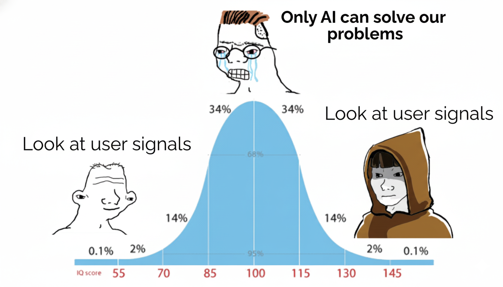

Before we start, a quick disclaimer: this is not a universal blueprint for how to build a search system. There are many ways to succeed, but even more to fail. What follows is our story, the lessons from a year spent rebuilding search from the inside out.

I have been building large scale software systems since 2014, always drawn to end to end architecture, connecting frontend, backend, data, and ML pipelines into coherent, scalable systems. For years, I built parts of search infrastructure. A year ago, I stepped into rebuilding search itself, the core that defines relevance. It was not my first search system, but it was the first time I faced its full complexity head on. That experience broke several assumptions I had carried for years.

The journey from pure architecture to user centered system design can be summarized in a meme every engineer knows well.

Funny as it is, that meme captures something true. We started with sound principles, drifted into unnecessary sophistication, and returned, wiser, to simplicity. What follows are the five assumptions I had to unlearn, and the truths that replaced them. If you are a Software Engineer, or have a leadership role in systems that shape user experience, these lessons may help you avoid the same detours.

## Assumption 1: Search is an Algorithm and Infrastructure Problem  
**The Truth: Search is a Data and Product Problem first.**

My instinct was to treat search as a systems design challenge. Build a solid architecture, make it fast, resilient, and technically pure. I missed the essence. Great search is shaped by user behavior, not architecture diagrams.

Search quality lives or dies on how well your system captures and learns from real world signals. The most powerful architecture is not the one that serves the model fastest, it is the one that learns fastest.

* **Data quality beats model complexity:** Simple ranking models trained on high quality, near real time user data often beat complex ones trained on stale offline sets.
* **Embrace the mess:** Real user data is noisy and incomplete. Build validation, monitoring, and guardrails that preserve useful signal instead of scrubbing it away.
* **Tight feedback loops are the leverage point:** Minimize the time between user action, logging, retraining, and deployment. That loop defines your true performance ceiling.

We stopped designing for theoretical relevance and started engineering for live feedback. That changed everything.

## Assumption 2: We must engineer for correctness from day one  
**The Truth: Velocity unlocks correctness.**

In interdependent systems, one broken piece can corrupt the end to end flow. The safe feeling is to perfect every component before shipping. That instinct kills learning. It slows you down before you know what matters.

* **Scrappy end to end tests teach fastest:** A rough but working pipeline in production will surface truths you will not see in a lab.
* **A-B testing is your compass:** Offline metrics are approximations. Reality is user response.
* **Refactor after validation:** Clean code that solves the wrong problem is worse than messy code that proves value. Once an idea shows impact, then harden it.

In complex systems, correctness is a byproduct of fast, validated learning.

## Assumption 3: Offline metrics are our north star  
**The Truth: Business impact is the north star.**

We obsessed over nDCG, precision, recall, and MAE. Dashboards looked great. First A B tests told a different story. **Offline metrics can mislead you.** They are useful for debugging, but they are not the goal.

* **Avoid the metrics rabbit hole:** You can overfit to synthetic judgments and still fail to improve engagement or conversion.
* **Tie performance to economics:** Latency and model complexity have costs. Measure tradeoffs against revenue, clicks, retention, or satisfaction.
* **Ship only what moves the needle:** If an experiment does not move a business KPI, it is not a success, no matter how elegant the solution.

Align every decision with measurable business outcomes. The roadmap gets clearer, and arguments get shorter.

## Assumption 4: Functional roles define the work  
**The Truth: Blurring the lines unlocks synergy.**

We began with clean separation, data science owns models, backend owns APIs, platform owns infrastructure. Collaboration existed, curiosity did not cross boundaries. We optimized locally, not globally.

Acceleration started when we turned specializations into a shared toolkit.

* **Enable data scientists:** Let them run A B tests and iterate on features without ticket ping pong.
* **Upskill backend engineers:** Give them data exploration and observability tools so they can see behavior, not just code.
* **Keep platform pragmatic:** Avoid premature abstractions. If the backend can host inference now, do it. Replatform when scale demands it.

This did not create chaos. It created alignment, faster learning, and shared ownership.

## Assumption 5: Technical excellence guarantees a great product  
**The Truth: Product mindset is the true compass.**

We often equate excellence with elegance, performance, or purity. The market rewards a different thing. It rewards solving the right problem for the right user, at the right cost.

A product mindset means you keep asking:

* **Who is the user, what are they trying to do, and what is hard for them today**
* **Which business outcome do we enable or improve, and how will we know**
* **What constraints define success, for example cost, latency, trust, safety, and compliance**

When these answers are clear, technical tradeoffs become obvious. You build the most effective system, not the most sophisticated one.

## Conclusion: Lessons from the core

A year of rebuilding search taught me humility. Architecture is not a fortress of correctness, it is a living system shaped by feedback and purpose.

Here is the checklist I will keep using:

1. **Focus on signals:** Build the shortest path from user action to system learning.  
2. **Optimize for learning speed:** Let velocity drive correctness, not the other way around.  
3. **Tie everything to business KPIs:** Technical success without impact is not success.  
4. **Organize for synergy:** Break functional barriers, enable shared ownership.  
5. **Adopt a product mindset:** Serve the user and the business, measure it, and adjust.  

The most valuable insights rarely come from textbooks or architecture diagrams. They emerge from building, breaking, and rebuilding real systems in the messy reality of production. As Einstein wisely noted: *"The only source of knowledge is experience."* This year of rebuilding search proved that truth over and over.

If you are leading or building similar systems, I hope these hard won lessons help you navigate the complexity with more clarity and less detour than we had.
