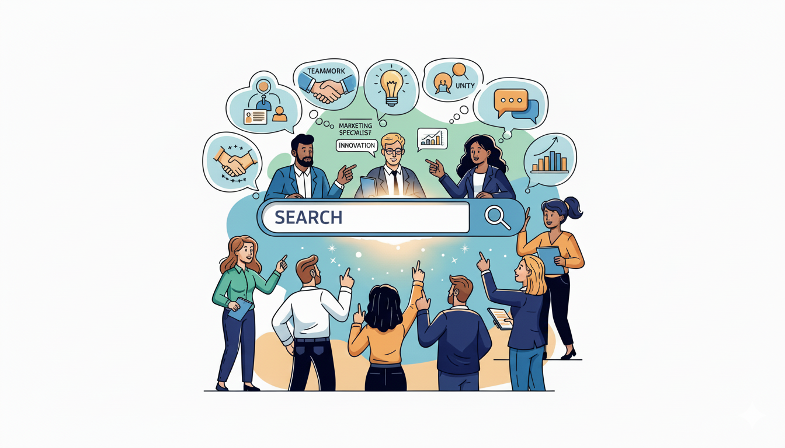

Before we dive in, a quick disclaimer: this is not a universal blueprint for how every search system must be built. As the saying goes, "There are many roads to success, but even more to failure." This is the story of our road—the lessons learned from an intense, year-long focus on rebuilding a core search system.

I've been building large-scale software since 2014, and my passion has always been the same: architecting robust, end-to-end systems that scale to millions. I love the craft of connecting frontend to backend, data pipelines to machine learning, and empowering teams to own and ship with velocity. For years, I contributed to various search systems, building out pieces of the infrastructure.

But a year ago, I dove headfirst into rebuilding one from its core. This wasn't my first year in engineering, nor my first encounter with search. It was a year of intense, singular focus on the heart of the beast—the part of the system that defines relevance itself. And that experience forced me to challenge assumptions I'd held for years.

That journey from established architectural principles to the nuanced reality of search is best captured by a meme every engineer instinctively understands.

This isn't just a joke; it's a roadmap of the humbling, and ultimately vital, lessons learned. As an experienced team, we started with solid principles, drifted into the tempting complexity of the middle, and eventually arrived at a more profound understanding on the right.

This post is the story of that journey. It's about the five foundational assumptions I, as a seasoned engineer, had to dismantle and the truths that replaced them. If you're an EM, Staff Engineer, or anyone passionate about building systems where user experience is paramount, this might save you from the same costly realizations.

## Assumption 1: Search is Primarily an Algorithm & Infrastructure Problem
**The Truth: Search is a Data and Product Problem First.**

My core strength is building scalable infrastructure. Naturally, my first instinct was to treat search as a classic systems design challenge. The goal was clear: create the most sophisticated, technically pure model and the most resilient platform to serve it. We would win with superior architecture.

But I was missing the soul of the problem. **Great search isn't forged in a design doc; it's sculpted by user interactions.** The most powerful tool isn't a better algorithm, but a cleaner feedback loop. My passion for connecting systems found its true north: connecting the user's intent directly back to the model.

The breakthrough came when we shifted our engineering focus from inventing relevance in isolation to building a system that could listen and learn from user signals at scale.

* **Data quality over model complexity:** Simple models fed with high-quality, real-time user interaction data consistently outperform complex models trained on stale, offline datasets. This is a data pipeline problem before it's an ML problem.
* **Embrace the mess:** Real-world client data is messy. My experience in building robust systems taught me to create strong validation and monitoring to manage this chaos, rather than trying to sanitize it away.
* **The product feedback loop is the ultimate scalable system:** The tightest possible loop between user action, data logging, model retraining, and deployment is the most critical piece of infrastructure you can build.

## Assumption 2: We Must Engineer for Correctness from Day One
**The Truth: Velocity Unlocks Correctness.**

As an experienced engineer, I embrace experimentation for learning. Yet, when faced with a system where so many new concepts—data science, ML, complex backend logic—must work together, the temptation to engineer for perfect correctness from the start is immense. In such a system, one failure can cascade and invalidate your results. The instinct is to ensure every component is pristine before integrating.

This is a trap. It leads to analysis paralysis and delays the single most important activity: learning from real-world feedback. The principle should be **make it work, then make it right.**

* **Scrappy tests are your best friend:** Got a hypothesis? Validate it with the quickest, dirtiest test you can build. A messy but functional end-to-end test in a real environment teaches you more than a perfectly architected component that hasn't seen production traffic.
* **A/B testing is the single source of truth:** All offline metrics are proxies. The only ground truth comes from a trustworthy A/B test in production, which tells you if you're actually moving the needle.
* **Refactor after validation:** Once an experiment proves an idea is valuable, *then* you invest the time to clean it up, add abstractions, and build robust infrastructure around it. The risk of building the wrong thing cleanly is far greater than the risk of building the right thing messily at first.

## Assumption 3: Offline Metrics Are Our Engineering North Star
**The Truth: Business Impact Is The North Star.**

Early on, we thought we needed to perfect our offline evaluation. We spent significant effort defining metrics like nDCG, MAE, precision, and recall. While these are all important diagnostic tools, we learned that focusing on them too early, before we could even observe key business KPIs, was a trap.

Here's the hard lesson: **your offline metrics can be lying to you.** They are useful for debugging, but they are not the goal.

* **The Metrics Rabbit Hole:** Over-investing in perfecting offline metrics before you have a solid A/B testing framework can lead to local optima. You might build a model that looks great on paper but fails to improve the user experience or move business metrics. Your beautiful nDCG score doesn't matter if users aren't clicking or converting.
* **The Economic Reality of Speed:** Latency is an economic choice, not just a technical one. Is a 50ms improvement worth a month of engineering time if it doesn't change user behavior or increase conversion? The answer must be tied to business outcomes.

We finally broke free when we **obsessively linked every experiment to a business KPI**. Did this change increase click-through rate? Did it improve conversion? If the answer was no, we didn't ship it, no matter how elegant the engineering.

## Assumption 4: Functional Roles Define the Work
**The Truth: Blurring the Lines Unlocks Synergy.**

We didn't start in a full-blown silo, but we did operate with a natural separation of tasks: data science, backend, and platform engineering. Everyone had their domain. The problem wasn't a lack of collaboration, but a lack of cross-pollination. We were missing out on massive synergies by staying in our functional lanes.

The real acceleration happened when we started blurring these lines.
* **Empowering Data Science:** A data scientist shouldn't have to file a ticket to validate a hypothesis. We found that giving them easier ways to run A/B tests directly led to faster, better ideas.
* **Upskilling the Backend:** A backend engineer benefits immensely from being able to do their own data exploration. When they can build their own powerful dashboards for continuous insights, they start asking better questions and building smarter solutions.
* **Pragmatic Platforming:** A platform engineer's first thought might be to build dedicated, reusable model serving capabilities. We realized that for early stages, the backend service can simply do its own model inference. This pragmatic approach—"just run it in the backend for now"—avoids premature abstraction and gets features to users faster.

The goal isn't to make everyone a generalist, but to create a team where functional expertise is a starting point, not a boundary.

## Assumption 5: Technical Excellence Guarantees a Great Product
**The Truth: A Strong Product Mindset is Our True Compass.**

This is the assumption that encompasses all the others. As engineers, we're trained to value technical superiority. We believe the best technology should win.

But the market doesn't reward you for technical excellence alone. It rewards you for solving a user's problem in a way that creates business value. **Building the wrong thing perfectly is a spectacular waste of time and a failure of our craft.**

A product mindset means deeply understanding the "why" behind the "what."
* **Who are our users?** What are they *really* trying to do?
* **What is the business goal?** Are we trying to maximize engagement, revenue, or user satisfaction?
* **How does our industry work?** What are the competitive pressures and unique constraints?

Technology is a powerful tool to serve the product and the user. When you have a deep understanding of the user, the business, and the industry, you have a compass that guides the technical decisions, ensuring you're not just building the system right, but that you're building the right system.

## Conclusion: Lessons from the Core

This year-long deep dive into rebuilding search was a masterclass in humility and perspective. It forced me to take years of experience in building scalable systems and re-forge it in the fires of user relevance. The journey is about these five shifts:

1.  **Focus on Signals:** Apply your systems thinking to build relentless, high-fidelity feedback loops from your users.
2.  **Optimize for Learning:** Use your architectural skills to optimize for experiment velocity, not premature correctness.
3.  **Tie Everything to Business KPIs:** Your work isn't done until you've moved a metric the business actually cares about.
4.  **Organize for Synergy:** Build cross-functional teams where expertise is shared, not siloed.
5.  **Develop a Product Mindset:** Fall in love with the user's problem, not just your technical solution. Let that be your guide.

This presentation, and by extension this post, was drafted with the help of AI to organize and articulate these lessons.[^1] It's a fitting meta-lesson: just as in search, the key is not just having a powerful tool, but guiding it with deep human insight and a clear focus on the desired outcome.

*"Wisdom is not a product of schooling but of the lifelong attempt to acquire it."* — Albert Einstein[^2]

---

## Footnotes

[^1]: The original presentation and this blog post were generated using Gemini, with all content created with AI assistance based on the foundational concepts and lessons learned.
[^2]: This quote from Albert Einstein was included in the original presentation and serves as a guiding principle for the continuous learning required in a complex field like search.