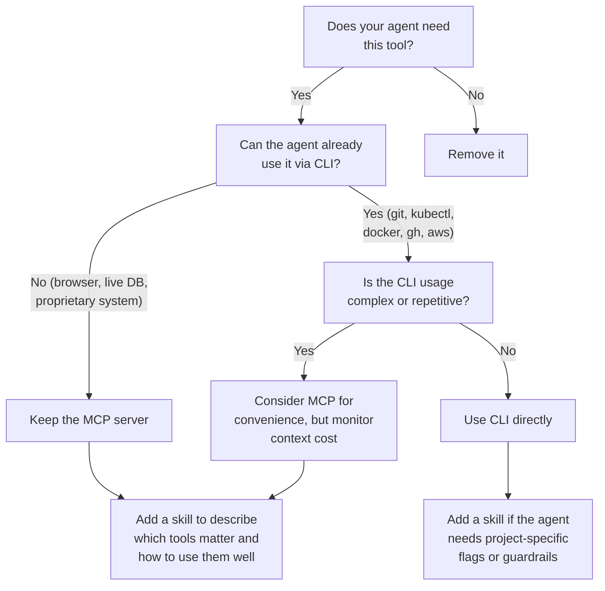

I counted the tool definitions loaded into my agent's context last week. 67,000 tokens. Before I typed a single prompt.

Four MCP servers, 50+ tool definitions, most of which my agent never called. I removed three of them. Same workflow, same results. The difference was that my agent stopped losing track of the codebase context halfway through conversations. It could hold the full picture of what I was working on because it was not spending a third of its memory on tools it would never use.

The problem is not MCP. The problem is using it where you do not need to. And the gap between "where MCP is essential" and "where MCP is just overhead" is wider than most setup guides suggest.

## Where MCP Is the Only Option

There is a category of tools where MCP is not a preference. It is the only viable architecture. Browser control is the clearest example.

When your agent needs to navigate a webpage, click a button, fill a form, or read a dynamic page rendered by JavaScript, there is no CLI for that. You cannot `gh browse` your way into a browser session. Chrome DevTools MCP, Playwright MCP — these give your agent a capability that simply does not exist otherwise. It can control an actual browser, interact with live interfaces, and automate workflows that were previously manual. This is MCP doing exactly what it was designed for: connecting an agent to a system it cannot access through text commands.

Research tools are similar. When you need your agent to fetch live web content, browse search results, or read a page that requires a real HTTP session, MCP is the right layer. A Brave Search MCP or a Fetch MCP gives the agent structured web access. The agent cannot replicate this with bash alone.

The same applies to persistent database connections that need a live session, or internal tooling with no public documentation. Anything where the agent needs to interact with a stateful, external system that was never designed to be driven from a command line.

In all these cases, not using MCP would be the wrong call. The capability genuinely requires the protocol.

## Where CLI Can Be Enough

Now consider the other category. Your agent wants to check open pull requests. List recent commits. Apply a Kubernetes deployment. Query your cloud provider's API.

Every tutorial tells you to install MCP servers for these. GitHub MCP, kubectl MCP, AWS MCP. Each one advertises all its tools to your agent upfront. The GitHub MCP server alone exposes 40+ tool definitions. Your agent loads every single one into its context window before you have asked anything.

But your agent already knows how to use `gh pr list`. It knows `kubectl get pods`. It has been trained on millions of Stack Overflow answers, documentation pages, and code examples for these tools. It can run them through a bash tool with zero extra tool definitions loaded.

That said, MCP servers have real advantages. They expose a structured interface, with typed tool definitions, descriptions, and parameters. They are usually packaged as npm modules or Docker containers that update automatically. You do not need to maintain scripts, write wrappers, or keep documentation in sync. For many teams, that convenience is worth it.

The tradeoff is context cost. A CLI call costs zero tokens in tool definitions. An MCP server for the same operation costs thousands, loaded at startup, whether the agent calls it or not. So the question becomes: is the convenience of this particular server worth the context space it takes from your actual work?

For well-known CLIs where the agent already has deep training data, the answer is often no. For internal tools, proprietary APIs, or systems with complex authentication flows, the structured interface of an MCP server can save more time than it costs.

## Skills: The Layer That Makes Both Better

There is another piece to this puzzle that most setup guides miss entirely. In Claude Code (and similar tools like OpenCode, Cursor, Windsurf), you can write skills. A skill is a markdown file that describes how to operate a tool. What parameters matter. What common mistakes to avoid. Where the API docs or OpenAPI spec live.

Skills are not a replacement for MCP. They are a complement to everything. A skill can describe how to use an MCP server more effectively, which of its 40 tools actually matter for your project, and what the gotchas are. A skill can describe how to use a CLI with project-specific flags and guardrails. A skill can point to an OpenAPI spec and explain which endpoints to avoid in production.

The Chrome DevTools skill I use for browser automation, for example, is a detailed reference that the agent loads on demand. It describes how to interact with the MCP server, what to watch out for, what sequences of actions work best. The MCP server provides the capability. The skill provides the context about how to use it well.

You can also go further. A skill can include a script that wraps a CLI with safety checks, rate limits, or project-specific defaults. That is more work than installing an MCP server, but it gives you guardrails that no server provides out of the box.

This is the question worth asking for each server in your config: does the convenience of this MCP server justify its context cost, or would a CLI call (maybe paired with a skill for context) get you the same result for less?

## The Context Tax Is Real

Every MCP server loads all its tool definitions at startup. This is not a minor cost.

Four servers with 50+ tools consumed 67,000 tokens in my setup. Cloudflare's own MCP best practices warn against treating an MCP server as a wrapper around your full API schema, specifically because agents with limited context windows cannot handle it[^1]. Their "Code Mode" research found that presenting tools as a TypeScript API instead of raw tool definitions produced dramatically better results, precisely because the tool definition overhead was hurting agent performance[^2].

This matters because context windows are finite, and **reasoning quality degrades as they fill up**. I have seen this directly: an agent that correctly refactored a 200-line file with 3 MCP servers loaded missed a critical import statement when the same task ran with 8 servers loaded. The tool definitions that nobody called pushed the code context further back in the window. The agent lost track of earlier file contents.

Anthropic knows this is a problem. Claude Code has a built-in feature called Tool Search that automatically defers MCP tool definitions when they exceed 10% of the context window. They engineered around the problem because it was hurting their users in practice.

In practice, tool usage follows a power law. Track which tools your agent calls over a week. Two or three do the heavy lifting. The other 47 definitions sit there, eating context, contributing nothing.

## Scope It Per Project, Not Globally

The default setup for most developers is global MCP configuration. Every project gets every server. Your coding project loads the research server. Your automation project loads the database server. This is the equivalent of importing every package in your language's ecosystem into every project.

Claude Code has the most mature scoping model right now, with three levels. Local scope is private to you, stored in `~/.claude.json`. Project scope lives in `.mcp.json` at the project root, checked into git, shared with your team. User scope is global. The other coding agents mentioned above have similar concepts, though the config formats differ.

The project-scoped `.mcp.json` is the one that matters most:

```json
{
  "mcpServers": {
    "chrome-devtools": {
      "command": "npx",
      "args": ["-y", "@modelcontextprotocol/server-chrome-devtools"],
      "env": { "CHROME_PORT": "9333" }
    }
  }
}
```

Environment variables keep secrets out of version control. The server only loads when you are in this project. Other projects are not affected.

Claude Code also lets you disable globally defined servers at the project level, and scope tools per agent so specific MCP tools only activate for agents that need them. One thing it does not offer is a simple on/off default per server in config. OpenCode does: each MCP entry has an `"enabled": true/false` field, so you can define a server once and keep it disabled until a specific project or agent needs it. A small difference, but it matters when you have a dozen servers defined globally and only want two active.

**The heuristic**: for each server, ask yourself whether the convenience justifies the context cost. Browser control, live research, stateful sessions - those typically do. Well-known CLIs like git, kubectl, and docker - those typically do not. When in doubt, start with CLI and add the MCP server if you find yourself writing the same complex commands repeatedly.

For teams, treat `.mcp.json` like `package.json`. Review MCP additions in pull requests. When someone adds a server for a tool that has a well-known CLI, that is a conversation, the same way adding an unnecessary dependency is a conversation. Onboard new developers with the project's `.mcp.json`, not a global dump of every server someone tried once.

## MCP Servers Have the Keys to Your Machine

One more thing that is not discussed enough. MCP servers running via stdio are local subprocesses. They have the same access to your filesystem, environment variables, network, and running processes as any program you run. If you install a server without reading it, it has full access to everything on your machine.

The permission model is binary. The server either has access or it does not. There is no per-tool authorization, no sandboxing by default, no way to say "this server can read files but not write them."

Read the source before installing. Use project scoping to limit which servers load where, so a compromised server in one project cannot reach another project's environment. For teams, Claude Code offers `managed-mcp.json`, a system-level config that restricts which servers developers can install via allowlists. If you would not `npm install` a package without checking its README, the same standard applies here.

## So, What Now?

If you are not sure where a tool falls, this decision tree can help:



MCP servers are convenient and well-structured, but they come with a context cost. For capabilities your agent cannot get any other way, like browser control or live research, that cost is easy to justify. For well-known CLIs where the agent already has deep training data, the math is different. A skill with guardrails might give you the same result for less.

Open your MCP config. For each server, ask: is the convenience worth the context space it takes? Keep the ones where the answer is clearly yes. For the rest, try CLI first, maybe with a skill for project-specific context. Move what stays into project-scoped config so each server only loads where it is actually needed.

The question is not whether to use MCP. The question is whether each server you have loaded is earning its context cost.

---

[^1]: Cloudflare. (2025). *Model Context Protocol (MCP) — Best Practices*. Cloudflare Developers. [https://developers.cloudflare.com/agents/model-context-protocol/](https://developers.cloudflare.com/agents/model-context-protocol/)

[^2]: Varda, K. & Pai, S. (2025). *Code Mode: the better way to use MCP*. Cloudflare Blog. [https://blog.cloudflare.com/code-mode/](https://blog.cloudflare.com/code-mode/)
