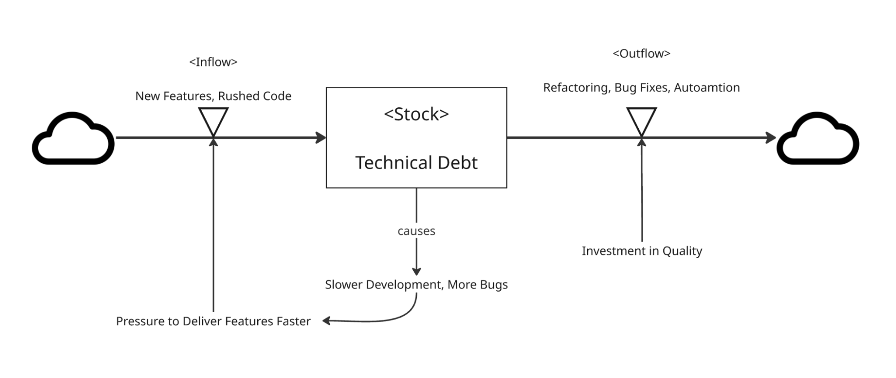
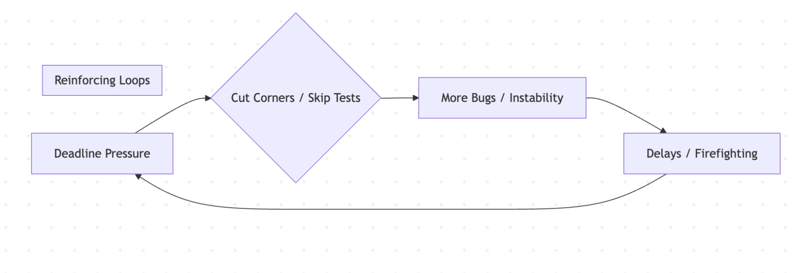
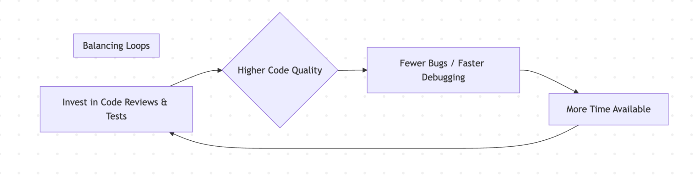
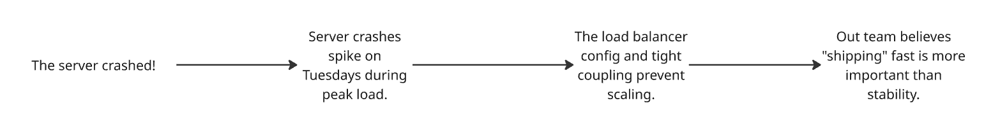
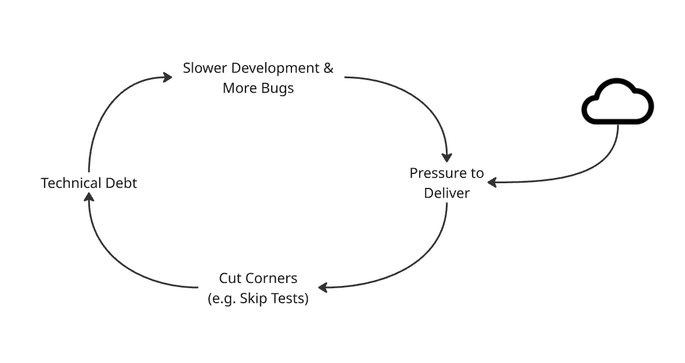

Imagine your codebase or software system is a bathtub. The water level represents accumulated issues like technical debt, bugs, performance bottlenecks. The faucet constantly pours in new features, necessary changes, and sometimes, rushed code (inflow). The drain represents the crucial work of refactoring, fixing bugs, improving tests, and paying down that debt (outflow).

What happens if the inflow consistently outpaces the outflow? The tub inevitably overflows. In software, this overflow manifests as unexpected delays, critical outages, user complaints, unpredictable delivery timelines, and team burnout.

Many teams react by frantically bailing water – pulling all-nighters, cutting corners elsewhere, pushing harder (often leading to more inflow problems). Systems thinking offers a different approach: instead of just bailing, let's examine the system itself. Can we adjust the faucet (improve code quality, better planning)? Can we widen the drain (automate testing, dedicate time for refactoring)?

This post will guide you through applying systems thinking to software development. You'll learn how to:

1.  **See the whole system:** Understand how different parts (code, people, processes) interact, moving beyond isolated bugs or features.
2.  **Diagnose root causes:** Use mental models to find why problems keep recurring.
3.  **Find high-impact solutions:** Apply changes at key "leverage points" for lasting improvement.
4.  **Measure what matters:** Focus on systemic health and sustainable pace, supported by real-world evidence and effective measurement practices.

Whether you're writing your first lines of code, leading a team, or defining the product roadmap, understanding these dynamics is key to building better software, faster and more reliably.

To effectively manage this “bathtub“, we first need to grasp the fundamental building blocks of any system.

## The Bathtub Model—Stocks, Flows, and Feedback Loops

### The Basics of System Dynamics

At its core, any system, including software development, involves:

* **Stocks:** Accumulations of things over time. Think of these as levels you can measure at a point in time (e.g., amount of technical debt, number of open critical bugs, psychological safety, economic value)[^1].
* **Flows:** The rates at which stocks change. These are actions happening over time (e.g., rate of new features added per sprint, rate of bugs fixed per week, rate of tests added)[^1].
* **Feedback Loops:** The interactions where a change in a stock or flow influences other parts of the system, potentially looping back to affect the original element. These loops drive the system's behavior[^2].

Donella H. Meadows, author of the book *Thinking in Systems*, describes a system like so:

"A system is a set of things—people, cells, molecules, or whatever—interconnected in such a way that they produce their own pattern of behavior over time. ... **A system is more than the sum of its parts**. It may exhibit adaptive, dynamic, goal-seeking, self-preserving, and sometimes evolutionary behavior."[^3]

Understanding system behavior often starts with measuring these stocks and flows over time[^4].

A system diagram visualizes the system having a specific problem driven angle. The "Bathtub Model" is a common analogy used in systems thinking to illustrate the basic dynamics of accumulation, where a stock is influenced by inflows and outflows[^5].

*Diagram: The Technical Debt Bathtub. Inflow increases the stock (debt), outflow decreases it. Pressure often increases inflow, while investment in quality increases outflow. Clouds are used to express boundaries (simplification).*

**Example:**

* If your team merges new code faster than it refactors or fixes underlying issues (inflow > outflow), the stock of technical debt rises.
* If you invest time in automating tests or improving deployment processes (increase outflow capacity), you can stabilize or reduce the debt level, even with ongoing feature development.

### Feedback Loops: The Hidden Forces Driving Your Team

Feedback loops are critical because they often explain *why* systems behave counterintuitively.

* **Reinforcing Loops:** These amplify change. A small push can lead to accelerating growth or decline[^2].

    

    *Result: A death spiral where pressure leads to poor quality, causing delays, which increases pressure.*

* **Balancing Loops (Stabilizers):** These seek equilibrium or a goal. They resist change and try to keep things stable[^2].

    

    *Result: A sustainable pace where quality investments free up time, allowing for continued investment.*

To fix systemic problems, you often need to adjust the feedback loops at play[^2]. This might involve strengthening balancing loops (like adding automated testing or dedicated refactoring time) to stabilize the system. When it comes to reinforcing loops, the strategy depends: we aim to weaken or break negative ones (like changing incentives that reward rushing over quality), but we should actively look for opportunities to initiate or strengthen positive reinforcing loops – think of how celebrating small wins can build morale that fuels bigger successes, or how investing in learning creates a cycle of improving skills and results.

It's important to note that while the bathtub provides a clear, fundamental example of a single-stock system, it's just one lens through which to view software development challenges. Many real-world systems involve multiple interacting stocks (think feature velocity, bug counts, *and* team energy levels all influencing each other) and exhibit more complex dynamic patterns beyond simple accumulation[^2]. However, the core principles you've learned here – identifying stocks, managing flows, and understanding feedback loops – are the essential building blocks for analyzing *any* system, regardless of its specific structure[^1].

Understanding these fundamental mechanics is the first step, but truly effective problem-solving also requires us to shift how we perceive issues – moving beyond immediate events to see the underlying patterns and structures. This is where 'Model Thinking' comes in.

## Model Thinking—Seeing Beyond Events to Systems

### The Four Levels of Understanding Systems

Reacting to problems often keeps us stuck. Systems thinking encourages digging deeper by recognizing different levels of understanding, often associated with the work of Peter Senge[^7]:

1.  **Events:** Reacting to isolated incidents ("Server crashed!"). Fixes are often temporary bandaids.
2.  **Patterns:** Observing trends over time ("Server crashed on Tuesday during peak load"). Allows for anticipation and better diagnosis.
3.  **System Structures:** Understanding *how* the parts relate – the processes, code architecture, team communication pathways ("The load balancer config and tight coupling prevent scaling"). This is where robust solutions lie.
4.  **Mental Models:** The deeply held beliefs and assumptions that shape the system ("Our team believes shipping fast is more important than stability"). Challenging these is often the deepest and most powerful way to create change[^7].

The goal is to move beyond reacting to Events and start understanding the Patterns, Structures, and Mental Models driving them[^7]. This shift is crucial for everyone, from junior dev spotting a recurring bug pattern to a project manager wondering why deliveries are unreliable.

### Why All Models Are Wrong (But Some Are Useful)

The bathtub, feedback loops, and levels are models – simplifications of complex reality. They help us focus but inevitably leave things out (like team morale, market changes, specific legacy constraints). As statistician George Box famously stated, "Essentially, all models are wrong, but some models are useful."[^8]

**When Models Fail:**

* They oversimplify reality (e.g., assuming adding more developers automatically speeds up a delayed project – a violation of Brooks's Law[^9]).
* They ignore crucial feedback (e.g., not updating delivery forecasts based on actual progress and encountered issues).
* We forget they are models and treat them as absolute truth[^3].

**How to Use Models Effectively:**

1.  **Be Explicit:** State the assumptions in your model.
2.  **Test Predictions:** Does the model help you anticipate behavior? ("If we add tests here, will bug rates decrease?")
3.  **Iterate:** When reality differs from the model, refine the model rather than blaming reality[^3]. This also applies to the bathtub model itself – it highlights tech debt accumulation well, but different problems might require models emphasizing interacting growth limits, resource competition, or significant delays in feedback. Part of developing systems thinking skill is recognizing which model structure best fits the problem at hand[^2].

Once we have a better model for understanding our system, the next critical question is: where should we intervene for maximum impact? Not all changes are created equal, which leads us to the concept of leverage points.

## Leverage Points—Where to Intervene for Maximum Impact

The systems thinker Donella Meadows identified various "leverage points" – places in a complex system where a small shift can cause significant change[^10]. Focusing effort here is more effective than pushing on points with less influence. Inspired by her work[^10], here are some high-impact leverage points particularly relevant for software teams (adapted from Meadows' original 12 points):

1.  **The Power to Transcend Paradigms (Mental Models):** (Highest Leverage)
    * This means changing the deepest beliefs about the system's purpose and how it works (Meadows' Leverage Point #1)[^10].
    * *Shift Example:* From "Move fast and break things" to "Stability *enables* sustainable speed." Or from "Quality is QA's job" to "Quality is everyone's responsibility."
    * *Business Impact:* This shift, while difficult, fundamentally changes priorities and leads to more resilient, predictable product development.

2.  **The Goals of the System:**
    * Aligning team goals with overall system health (Meadows' Leverage Point #3)[^10].
    * *Shift Example:* Rewarding teams for improving deployment frequency, reliability and reducing incident recovery time, not just shipping features by a deadline. Crucially, this involves defining how progress towards these goals will be measured.
    * *Business Impact:* Directly focuses effort on outcomes that improve user experience, delivery speed, and predictability.

3.  **The Structure of Information Flows (Feedback Loops):**
    * Who knows what, when? Faster, clearer feedback improves adaptation and learning (Meadows' Leverage Point #6)[^10].
    * *Shift Example:* Implementing robust CI/CD pipelines for immediate code feedback. Making system performance and deployment metrics visible to everyone (including Product). Establishing quick communication channels between development and operations.
    * *Business Impact:* Catches issues earlier when they are cheaper to fix, reduces integration surprises, enables faster learning, and improves transparency.

4.  **System Structure (Rules, Incentives, Physical Structure):**
    * Changing rules, incentives, or how components are organized (architecture, team structure) (Related to Meadows' Leverage Points #5, #8, #7, #10, #11)[^10].
    * *Shift Example:* Enforcing code reviews, adopting loosely coupled architectural patterns (like microservices or well-defined modules) to allow independent changes, organizing teams around business capabilities.
    * *Business Impact:* Can improve scalability, maintainability, reduce coordination overhead, and enable faster, safer changes to specific parts of the system.

**Other Impact Leverage Points** (Still potentially useful, but less transformative on their own):

* Adjusting parameters (e.g., tweaking sprint lengths, changing minor configurations) (Meadows' Leverage Point #12)[^10].
* Adding more resources without changing the underlying system dynamics (e.g., hiring more people into a high-friction process often just increases cost and communication overhead, aligning with Brooks's Law[^9]).

By focusing your energy on higher leverage points like changing mental models, system goals, feedback loops, or fundamental structures yields far more durable results than fiddling with minor parameters[^10]. Even junior developers can contribute by highlighting pattern breaks, suggesting improvements to local feedback loops (e.g., better unit testing), and participating in constructive code reviews.

Identifying these leverage points is powerful, but does focusing on them truly yield results in practice? Fortunately, extensive research in the software development field provides compelling evidence that it does.

## Evidence from the Field: How Systemic Changes Drive Performance

Instead of relying only on analogies or illustrative examples, let's look at broad evidence from real-world software development. The DevOps Research and Assessment (DORA) program, now part of Google Cloud[^11], has conducted years of rigorous research across thousands of organizations globally[^12]. Their findings, widely popularized by the book **"Accelerate"**[^13], provide strong evidence that applying principles aligned with systems thinking directly leads to higher performance.

**Connecting DORA Capabilities to Systems Thinking**

DORA identifies key technical, process, and cultural capabilities that distinguish high-performing organizations[^14]. These capabilities map directly to the systems thinking concepts we've discussed:

* **Continuous Delivery Practices (CD):** Extensive use of version control, automated testing, automated deployments, and CI pipelines directly improves feedback loops (Leverage Point \#3), providing rapid information about code quality and deployability[^14]. This is like widening the bathtub drain and installing sensors.
* **Architecture:** Loosely coupled architectures allow teams to test and deploy their services independently, representing a structural change (Leverage Point \#4) that reduces bottlenecks and improves flow[^14].
* **Monitoring and Observability:** Implementing tools and practices to understand system health in production enhances information flows (Leverage Point \#3), enabling faster detection and recovery from problems (improving outflow effectiveness)[^14].
* **Product and Process:** Lean management practices (e.g., limiting work-in-progress) manage system flows. Customer feedback integration improves feedback loops[^14].
* **Culture:** A culture that supports psychological safety, learning from failure, and collaboration represents a paradigm shift (Leverage Point \#1) and influences system goals (Leverage Point \#2)[^14]. High trust and emphasis on quality are hallmarks.

**The Measurable Results**

The DORA research consistently finds that organizations excelling in these capabilities achieve significantly better outcomes. These metrics are key because they reflect the system's overall flow efficiency (throughput) and its resilience (stability)[^15]:

* **Faster Throughput:** High performers deploy code significantly more frequently (sometimes multiple times per day) and have much shorter lead times for changes (from commit to production)[^15]. This indicates efficient system flow and effective feedback loops.
* **Improved Stability & Resilience:** High performers experience lower change failure rates (fewer deployments causing incidents) and can restore service much faster when incidents do occur (Mean Time To Restore \- MTTR)[^15]. This shows the effectiveness of quality practices (outflow) and robust system structure.
* **Organizational Performance:** These technical improvements are also strongly correlated with better overall organizational performance, including profitability, market share, and productivity[^13].

**The Systems Thinking Link**

The DORA findings aren't magic; they are the result of organizations systematically addressing the dynamics of their software development systems. By investing in faster feedback, modular structures, aligned goals, and a quality-focused culture (hitting high-leverage points), they create virtuous cycles that lead to both speed *and* stability[^13]. This real-world evidence strongly supports the idea that taking a systems thinking approach – redesigning the "bathtub's plumbing" – is far more effective than simply asking people to "bail water faster."

Seeing this evidence is motivating, but how can you start applying these ideas yourself or within your team? Thankfully, you can begin with some simple, yet powerful, tools available today.

## Tools to Start Today

You don't need complex software to start applying systems thinking. Here are a few practical tools:

### 1\. The 5 Whys

A simple technique to move from an event/symptom towards root causes. Ask "Why?" repeatedly. This technique was developed by Sakichi Toyoda and popularized within the Toyota Production System by Taiichi Ohno[^16].

* **Problem:** "The deployment to production failed."
    1.  *Why?* A critical dependency was missing on the server.
    2.  *Why?* It wasn't included in the automated deployment script.
    3.  *Why?* There were no integration tests covering this dependency interaction.
    4.  *Why?* The team felt they didn't have time to write those tests.
    5.  *Why?* Team/Company culture prioritizes shipping new features above ensuring robustness through testing. (Often points towards Mental Models or System Goals)

*Use this:* Next time you fix a non-trivial bug, try it! Share the findings.

### 2\. Causal Loop Diagrams (CLDs)

Simple diagrams to visualize feedback loops. Helps teams discuss system dynamics[^17]. Use pen & paper, a whiteboard, or tools like PlantUML.

*Purpose:* To map out the cause-and-effect relationships you believe are driving behavior.

*Example CLD showing how pressure can spiral into more debt and slowness.*

### 3\. The "Widen the Drain" Rule (e.g., 20% Rule)

A structural rule to ensure outflow capacity. Dedicate a consistent portion of your team's time (e.g., 1 day per week, 20% of sprint capacity) specifically to *outflow* activities:

* Refactoring code
* Improving test coverage and automation
* Paying down technical debt
* Improving documentation
* Enhancing CI/CD pipelines
* **Why this helps Product:** This isn't "lost" feature time. It's an investment in *future speed and predictability*. It prevents the system from clogging up, reducing emergencies and enabling smoother, faster feature delivery in the long run, as supported by research like DORA's findings on technical practices[^13][^18]. Discuss and agree on this as a team, potentially starting smaller and demonstrating the benefits.
* **How to prioritize:** Focus this time on the debt or improvements that cause the most pain, block future work, carry the highest risk, or align with broader improvements suggested by DORA capabilities (like improving test automation)[^14].

### 4\. Tracking System Behavior (Measurement)

Systems thinking isn't just about diagrams; it's about understanding dynamics through observation and measurement[^4]. Effective measurement goes beyond simple output tracking:

* **Measure Stocks & Flows Over Time:** Don't just look at snapshots. Track key stocks (like the size of the bug backlog, estimated story points of tech debt) and flows (like feature completion rate, bug fix rate, deployment frequency) consistently over weeks or months[^4]. This reveals patterns (Level 2 thinking) – is the bathtub filling or draining?
* **Look for Leading Indicators:** While lagging indicators (like number of production outages, customer satisfaction scores) tell you about past performance, leading indicators might predict future outcomes. Examples could include trends in automated test coverage, code complexity scores in critical modules, or lead time for changes. Identifying good leading indicators helps you anticipate and prevent problems[^19].
* **Connect Metrics to Goals:** Ensure your measurements align with the system goals you care about (Leverage Point \#2)[^10]. If the goal is stability, measure stability metrics (like MTTR, Change Fail Rate). If it's faster learning, measure lead time or deployment frequency[^15].
* **Avoid Vanity Metrics:** Be wary of metrics that look good but don't reflect actual system health or progress towards goals (e.g., lines of code written, number of meetings held). Focus on metrics that drive meaningful insights and actions[^19].

Starting with simple tracking of key stocks and flows over time is a powerful first step for any team member to contribute to understanding the system better.

Armed with an understanding of system dynamics, leverage points, real-world evidence, and practical tools including measurement, let's revisit the core message and chart a path forward.

## Conclusion: From Chaos to Clarity

Software systems are like bathtubs... or sometimes like interconnected ponds, or ecosystems with competing species. The specific model might change, but the underlying truth remains: you can spend all your energy reacting to surface events, or you can step back, understand the dynamics, measure the behavior, and make targeted adjustments to the structure and flows[^2].

Systems thinking provides the tools and mindset to move from reactive firefighting to proactive system design. It helps everyone – developers, leads, product managers – understand the forces at play and work together more effectively.

Real-world research confirms that organizations that embrace practices rooted in systems thinking principles achieve significantly better speed, stability, and overall performance[^13].

**Your Next Steps:**

1.  **Identify a "Bathtub" (or other System):** Pick an area that feels like a struggle (e.g., bug backlog, flaky tests, slow deployments, long feature lead times). Ask: Is the bathtub the right starting model here, or is something else interacting?
2.  **Sketch the System:** Draw the main stocks, inflows, and outflows you see. What feedback loops might be involved? Use the 5 Whys on a recent issue in that area. Think about how you could measure the key stocks and flows.
3.  **Find Leverage:** Where could a small change make a big difference? Is it improving a feedback loop (like test automation)? Changing structure (like team organization or code modularity)? Shifting a goal or mental model? How will you measure the impact of the change?
4.  **Start Small & Communicate:** Propose a small experiment based on your analysis. Use the models and language here, potentially referencing DORA findings, to explain the *why* to your team, lead, or product manager, focusing on the expected systemic benefits and how you'll track progress.

*"The programmer’s task is, in fact, to design a system that does not merely fight complexity but actively absorbs it."* — Adapted from Fred Brooks[^20]

**Call to Action:** What's your team's biggest "overflowing bathtub"? How might insights from systems thinking or research like DORA help address it?

Remember, the bathtub was our entry point; the broader field of system dynamics offers many more models and archetypes to explore as you encounter increasingly complex challenges[^2].

**Key Takeaways:**
- See systems, not just events: Look for patterns, structures, and mental models[^7].
- Use models (like the bathtub) wisely: They simplify reality; test and refine them, and know when other models are needed[^3][^8].
- Intervene at high-leverage points: Focus on goals, paradigms, feedback, and structure for maximum impact[^10].
- Invest in outflow & feedback: Dedicate time to reduce debt and improve quality; enhance information flow. Real-world data confirms this boosts performance[^13].
- Measure systemic outcomes: Track stocks, flows, and leading indicators over time to understand system health and progress[^4][^19].
- Measure what matters: Align metrics with goals and avoid vanity metrics[^10][^19].

This post blends theory, diagrams, and real-world evidence to make systems thinking actionable. By understanding and applying these principles, we can build healthier codebases, foster more effective teams, and deliver value more reliably and sustainably. Now – go improve the *system*\!

---

## Footnotes

[^1]: Meadows, D. H. (2008). *Thinking in Systems: A Primer* (D. Wright, Ed.). Chelsea Green Publishing. Stocks are described as accumulations or foundations of a system, measurable at a point in time. Flows are the rates that change stocks over time.
[^2]: Meadows, D. H. (2008). *Thinking in Systems: A Primer* (D. Wright, Ed.). Chelsea Green Publishing. Feedback loops (reinforcing and balancing) are described as the mechanisms driving system behavior, often leading to complex or counterintuitive outcomes.
[^3]: Meadows, D. H. (2008). *Thinking in Systems: A Primer* (D. Wright, Ed.). Chelsea Green Publishing. p. 188 (Definition as cited in the blog post). Also see p. 11 for a similar definition: "A system is an interconnected set of elements that is coherently organized in a way that achieves something."
[^4]: Meadows, D. H. (2008). *Thinking in Systems: A Primer* (D. Wright, Ed.). Chelsea Green Publishing. Understanding system behavior involves observing its history and tracking data over time, particularly stocks and flows.
[^5]: The Bathtub analogy is a widely used illustration in systems thinking to explain basic stock and flow dynamics. See Meadows, D. H. (2008). *Thinking in Systems: A Primer* (D. Wright, Ed.). Chelsea Green Publishing. pp. 19-21.
[^6]: The concept of "Bathtub Dynamics" and the common difficulty people have in understanding accumulation (stock-flow failure) was extensively studied by Sweeney, L. B., & Sterman, J. D. (2000). Bathtub dynamics: initial results of a systems thinking inventory. *System Dynamics Review*, 16(4), 249–286.
[^7]: The concept of levels of understanding (Events, Patterns, Structures, Mental Models) is central to Peter Senge's work on learning organizations and systems thinking. See Senge, P. M. (1990, 2006). *The Fifth Discipline: The Art & Practice of The Learning Organization*. Doubleday/Currency. While the exact four-level diagram may vary, the book emphasizes moving beyond event-level reactions to understand underlying structures and mental models.
[^8]: Box, G. E. P. (1976). Science and statistics. *Journal of the American Statistical Association*, 71(356), 791–799. The quote is often expanded to "All models are wrong, but some are useful."
[^9]: Brooks, F. P., Jr. (1975, 1995). *The Mythical Man-Month: Essays on Software Engineering*. Addison-Wesley Professional. Brooks's Law states: "Adding manpower to a late software project makes it later."
[^10]: Meadows, D. (1999). *Leverage Points: Places to Intervene in a System*. The Sustainability Institute. This paper outlines 12 leverage points in increasing order of effectiveness, from parameters up to the power to transcend paradigms. The list in the blog post adapts and groups these for a software context.
[^11]: DevOps Research and Assessment (DORA) is a research program, now part of Google Cloud, focused on understanding and driving high performance in technology organizations. See Google Cloud. (n.d.). *DevOps*. Retrieved April 18, 2025, from https://cloud.google.com/devops
[^12]: DORA publishes annual State of DevOps reports based on years of research involving tens of thousands of professionals globally. See DORA. (n.d.). *Publications by DORA*. Retrieved April 18, 2025, from https://dora.dev/publications/
[^13]: Forsgren, N., Humble, J., & Kim, G. (2018). *Accelerate: The Science of Lean Software and DevOps: Building and Scaling High Performing Technology Organizations*. IT Revolution Press. This book details the research findings connecting specific capabilities to software delivery performance and organizational outcomes.
[^14]: Forsgren, N., Humble, J., & Kim, G. (2018). *Accelerate: The Science of Lean Software and DevOps: Building and Scaling High Performing Technology Organizations*. IT Revolution Press. The book identifies 24 key capabilities across technical, process, measurement, and cultural domains that drive performance. See also the summary on Wikipedia: *DevOps Research and Assessment*. (2025, February 10). In Wikipedia. https://en.wikipedia.org/wiki/DevOps_Research_and_Assessment#24_Key_Capabilities
[^15]: The four key metrics used by DORA to measure software delivery performance are Deployment Frequency, Lead Time for Changes, Mean Time to Restore (MTTR), and Change Failure Rate. See Forsgren, N., Humble, J., & Kim, G. (2018). *Accelerate: The Science of Lean Software and DevOps: Building and Scaling High Performing Technology Organizations*. IT Revolution Press. Also described in GitLab Docs. (n.d.). *DORA metrics*. Retrieved April 18, 2025, from https://docs.gitlab.com/ee/user/analytics/dora_metrics.html (Note: Updated link retrieval date and common GitLab EE path)
[^16]: The 5 Whys technique originated with Sakichi Toyoda and was integral to the development of the Toyota Production System, popularized by Taiichi Ohno. See Wikipedia contributors. (2025, April 7). *Five whys*. In Wikipedia, The Free Encyclopedia. Retrieved April 18, 2025, from https://en.wikipedia.org/wiki/Five_whys
[^17]: Causal Loop Diagrams (CLDs) are a standard tool in system dynamics for visualizing feedback structures within a system. See Meadows, D. H. (2008). *Thinking in Systems: A Primer* (D. Wright, Ed.). Chelsea Green Publishing. Chapter 2 discusses loops.
[^18]: The principle of dedicating capacity to improvement work (like refactoring, automation, debt reduction) aligns with DORA's findings that technical practices (e.g., test automation, CI/CD, loosely coupled architecture) drive performance. See Forsgren, N., Humble, J., & Kim, G. (2018). *Accelerate: The Science of Lean Software and DevOps: Building and Scaling High Performing Technology Organizations*. IT Revolution Press.
[^19]: Effective measurement in systems involves tracking behavior over time, understanding stocks and flows, linking metrics to system goals, and focusing on meaningful indicators rather than superficial "vanity" metrics. These principles are consistent with systems thinking practices and DORA's approach. See Meadows, D. H. (2008). *Thinking in Systems: A Primer* (D. Wright, Ed.). Chelsea Green Publishing. See also Meadows, D. (1999). *Leverage Points: Places to Intervene in a System*.
[^20]: This quote captures the essence of Fred Brooks's discussions on tackling the inherent or "essential" complexity of software design, as distinct from "accidental" complexity. While this exact phrasing is not found in the primary sources reviewed, the concept is central to his work. See Brooks, F. P., Jr. (1987). No Silver Bullet: Essence and Accidents of Software Engineering. *Computer*, 20(4), 10–19. Also see Brooks, F. P., Jr. (1975, 1995). *The Mythical Man-Month: Essays on Software Engineering*. Addison-Wesley Professional.